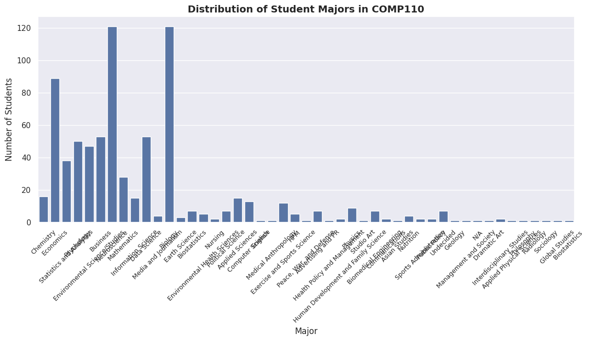
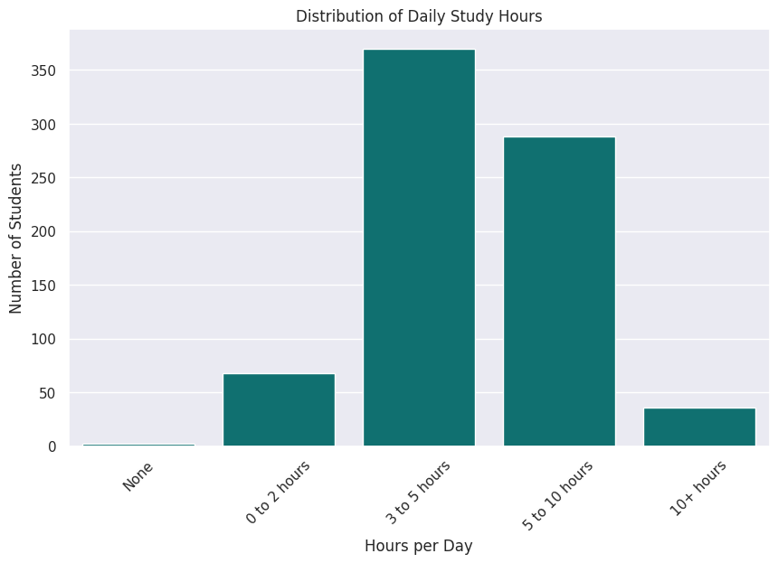
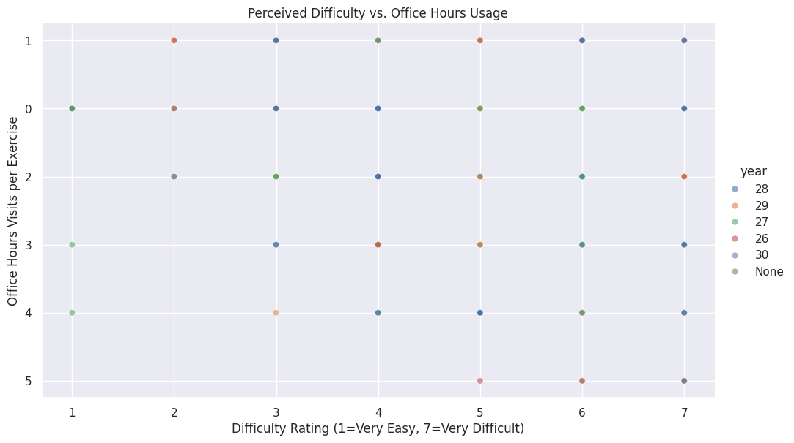

---
# Do not edit the text between these lines!
layout: default
---

# EX09 - Data Analysis for Continous Improvement

## Virtual Office Hours: Addressing Unmet Student Needs

## Project Summary 

The combined analysis of the anonymized survey data from both instructors' sections, processed using custom data utilities like concat and convert_columns_to_int, reveals that students with high perceived difficulty are among those with low office hours usage. This suggests that students who find COMP110 most challenging are not accessing current in-person office hours due to barriers such as scheduling conflicts, transportation issues, or social anxiety.

> ** Key Insight:** The bottom-right quadrant of the scatter plot reveals an unmet need. Students who are struggling the most are already maximizing effort but not receiving support through current office hours.

## Visualizations

### Visualization 1: Distribution of Student Majors

The categorical distribution confirms that COMP110 successfully reaches a divere range of majors beyong Computer Science, including Informative Science, Business, Biology, and undecided students. This means students come from various backgrounds with different scheduling needs, technical comfort level and potential barriers to attending in-person office hours.

### Visualization 2: Office Hours Visit Distribution

The workload histogram reveals a significant cluster of students reporting 0-1 office hours visits per programming exercise. This suggests barrier issues like scheduling conflicts, transportation problems, commute challenges, or social anxiety preventing students from accessing the help they need.

### Visualization 3: Difficulty vs. Office Hours Scatter Plot

By using convert_columns_to_int to process survey responses, the resulting relational scatter plot shows that students with high perceived difficulty (6-7) are among those with low office hours usage (0-1). This demonstrates that students are not struggling due to lack of effort, but rather due to the complexity of the material itself. However, these students are not using current in-person office hours.

> ** Recommendation:** Based on this analysis,I recommend implementing virtual office hours as a supplement to existing in-person office hours to address this unmet need.

## Final Conclusion

The combined analysis of the anonymized survey data from both instructors' sections, processed using custom data utilities like concat and convert_columns_to_int, reveals a clear unmet need in COMP110. By using convert_columns_to_int to process survey responses, the resulting relational scatter plot reveals that students with high perceived difficulty are among those with low office hours usage, suggesting that students are not struggling due to a lack of effort, but rather due to the complexity of the material itself and barriers to accessing help.

While the categorical distribution confirms that the course successfully reaches a diverse range of majors beyong Computer Science, the workload histogram indicates a significant cluster of students reporting 0-1 office hours visits per exercise. This suggests that students who find the material most challenging are already maximizing their personal effort but are not receiving support through current office hours. Implementing virtual office hours would create substantial value for these students by providing accessible, flexible support that removes common barriers.

However, adopting this initiative involves significant trade-offs, such as the high "cost of production" for instructors and TAs, the potential for "information overload" if too many supplementary options are added to an already rigorous workload, and the risk that providing too much support could inadvertently create a "crutch," potentially reducing the development of independent debugging skills which are essential for long-term success. To refine this idea in future, the project should move toward longitudinal tracking to identify exactly which units, such as loops or memory management, trigger the highest spikes in difficulty. 

Future refinements of this project should include longitudinal tracking of student difficulty ratings and more granular data collection to identify exactly which tasks are consuming the most time, ensuring that future course interventions directly address the most significant conceptual hurdles. Future work should also include a comparative A/B test across different sections to measure if virtual office hours actually lead to a measureable increase in "understanding" scores for high-difficulty students, ensuring that instructional refinements are addressing the most significant student needs without increasing the overall time burden on students or staff.

## Extensions and Refinements

- **Longitudinal Tracking** - Identify which course units trigger the highest difficulty spikes
- **Barrier-Specific Surveys** - Ask students what prevents them from attending office hours
- **Comparative A/B Testing** - Measure if virtual office hours increases understanding scores
- **Virtual OH Time Optimization** - Find best times for struggling students
- **Granular Data Collection** - Identify which tasks consume the most time

## Cost and Trade-offs

- **Costs:** Technology (Zoom license), TA time, training, production coordination
- **Trade-offs:** Resource allocation, information overload, reduced in-person attendance, technical issues
- **Negatively impacted stakeholders:** TAs (increased workload), instructors (coordination), students with poor internet access

---
